# GIGFLOW - Asynchronous Microservices Architecture

## Table of Contents
1. [Architecture Overview](#architecture-overview)
2. [Microservices Design](#microservices-design)
3. [Database Strategy](#database-strategy)
4. [Event-Driven Communication](#event-driven-communication)
5. [API Gateway Design](#api-gateway-design)
6. [Real-Time Communication](#real-time-communication)
7. [System Architecture Diagram](#system-architecture-diagram)
8. [Core Workflows](#core-workflows)
9. [Data Models](#data-models)
10. [Infrastructure & Deployment](#infrastructure--deployment)
11. [Security Considerations](#security-considerations)

---

## Architecture Overview

GIGFLOW is a gig-work platform connecting Hirers with Bidders through an asynchronous, event-driven microservices architecture. The system supports:
- Role-based authentication (Hirer/Bidder)
- Real-time bid notifications via WebSockets
- AI-powered recommendation system
- Integrated chat and video communication
- Secure escrow payment system

### Design Principles
- **Domain-Driven Design**: Each microservice owns its domain
- **Event-Driven Architecture**: Async communication via Kafka
- **CQRS Pattern**: Separate read/write models for query optimization
- **Circuit Breaker**: Resilience against service failures
- **Event Sourcing**: Audit trail for critical operations (payments)

---

## Microservices Design

### Core Services

| Service | Technology | Responsibility |
|---------|------------|----------------|
| **API Gateway** | Spring Cloud Gateway | Request routing, auth validation, rate limiting |
| **Auth Service** | Spring Boot + PostgreSQL | Authentication, authorization, JWT management |
| **User Service** | Spring Boot + PostgreSQL | User profiles, roles, preferences |
| **Gig Service** | Spring Boot + MongoDB | CRUD operations for gigs, bid management |
| **Bid Service** | Spring Boot + PostgreSQL | Bid lifecycle, bidding rules, history |
| **Recommendation Service** | Python + FastAPI + Vector DB | ML predictions, similarity matching |
| **Communication Service** | Node.js + MySQL + WebRTC | Real-time chat messaging, video call signaling, socket sessions |
| **Payment Service** | Spring Boot + PostgreSQL | Escrow, transactions, payment processing |
| **Notification Service** | Spring Boot + Redis Pub/Sub | Push notifications, email, SMS |
| **Analytics Service** | Spring Boot + ClickHouse | Aggregated metrics, dashboards |
| **Search Service** | Spring Boot + Elasticsearch | Full-text search, filtering, aggregation |

### Service Communication

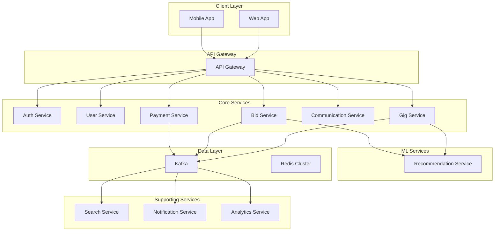

---

## Database Strategy

### Polyglot Persistence

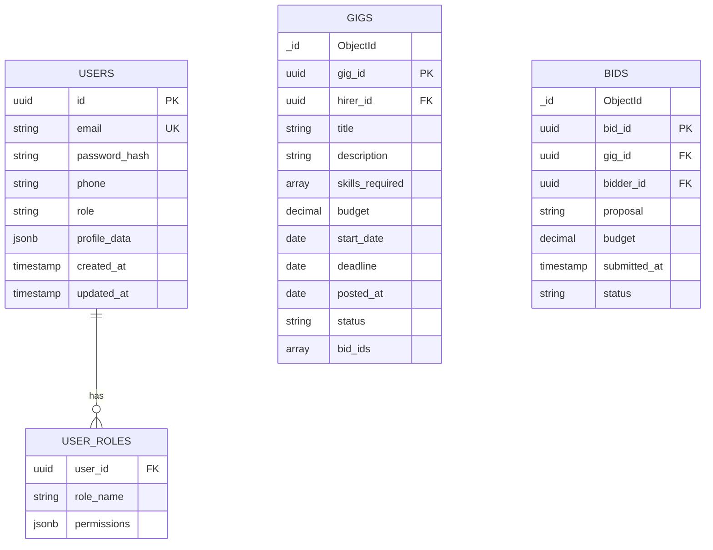

### Database Per Service

| Service | Database | Justification |
|---------|----------|---------------|
| Auth Service | PostgreSQL | ACID compliance for auth tokens, user data |
| User Service | PostgreSQL | Relational user profiles, relationships |
| Gig Service | MongoDB | Flexible schema for gig attributes, nested bids |
| Bid Service | PostgreSQL | Transactional integrity for bid lifecycle |
| Communication Service | MySQL | ACID compliance for message history and video room states |
| Payment Service | PostgreSQL | ACID compliance for financial transactions |
| Recommendation Service | PostgreSQL + Vector DB | Structured ML features + embeddings |
| Search Service | Elasticsearch | Full-text search, aggregations |
| Analytics Service | ClickHouse | OLAP queries, time-series analytics |
| Notification Service | Redis | Pub/Sub, in-memory queue |


---

## Event-Driven Communication

### Kafka Topics Structure

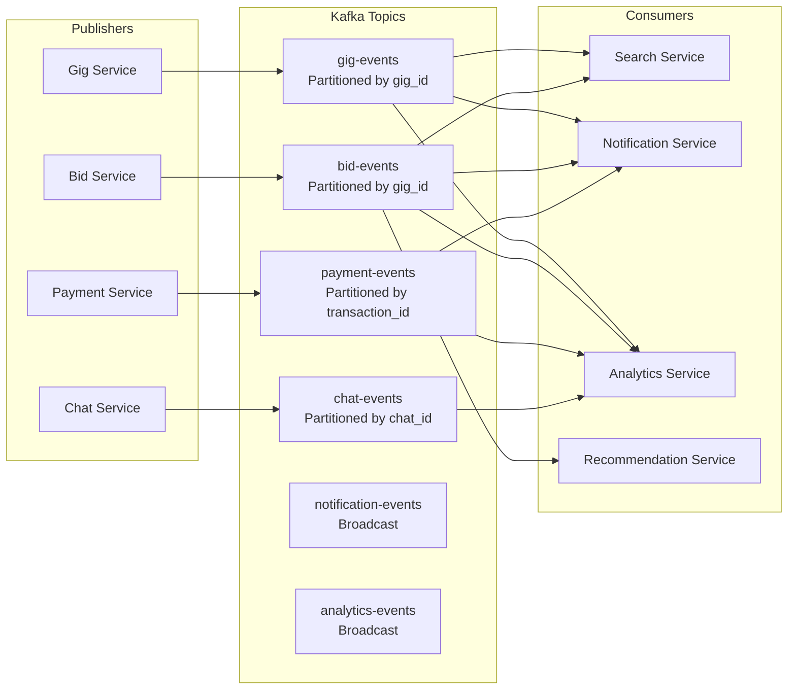

### Event Schema Examples

```json
{
  "event_type": "BID_CREATED",
  "event_id": "evt-uuid",
  "timestamp": "2024-01-15T10:30:00Z",
  "payload": {
    "bid_id": "bid-uuid",
    "gig_id": "gig-uuid",
    "bidder_id": "bidder-uuid",
    "budget": 1500.00,
    "proposal": "I can complete this project in 2 weeks..."
  }
}
```

### Kafka Topics Detail

| Topic | Partitions | Retention | Purpose |
|-------|------------|-----------|---------|
| `gig-events` | 12 | 7 days | Gig CRUD, status changes |
| `bid-events` | 12 | 7 days | Bid lifecycle events |
| `payment-events` | 24 | 30 days | Payment processing, escrow |
| `chat-events` | 6 | 3 days | Message delivery, read status |
| `notification-events` | 1 | 1 day | Push notifications, email |
| `analytics-events` | 1 | 90 days | Metrics aggregation |

---

## API Gateway Design

### Gateway Responsibilities

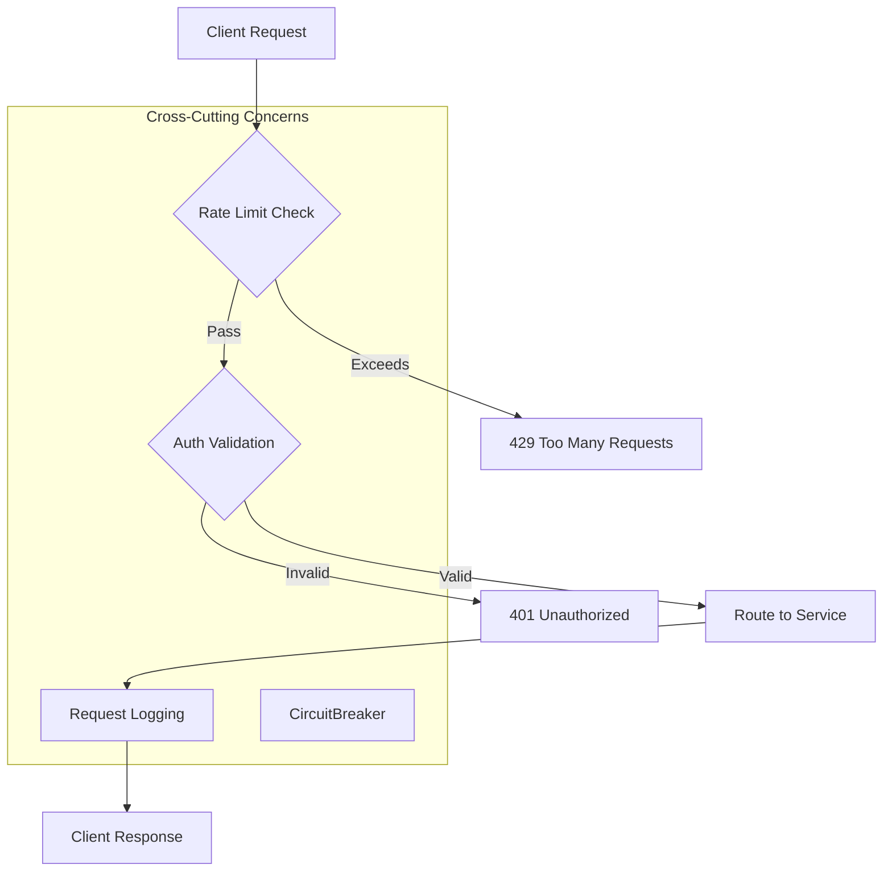

### API Routes

| Path Pattern | Service | Auth Required | Rate Limit |
|--------------|---------|---------------|------------|
| `/api/v1/auth/**` | Auth Service | No | 10 req/min |
| `/api/v1/users/**` | User Service | Yes | 100 req/min |
| `/api/v1/gigs/**` | Gig Service | Yes | 200 req/min |
| `/api/v1/bids/**` | Bid Service | Yes | 150 req/min |
| `/api/v1/chat/**` | Chat Service | Yes | 500 req/min |
| `/api/v1/video/**` | Video Service | Yes | 50 req/min |
| `/api/v1/payments/**` | Payment Service | Yes | 100 req/min |
| `/api/v1/search/**` | Search Service | Yes | 300 req/min |
| `/api/v1/recommendations/**` | Rec Service | Yes | 50 req/min |

---

## Real-Time Communication

### WebSocket Architecture

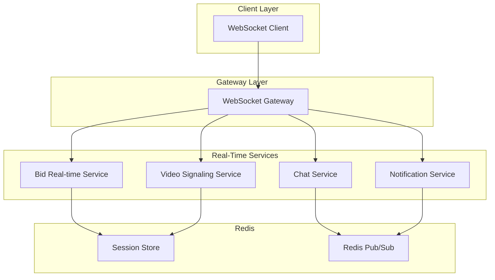

### WebSocket Endpoints

| Endpoint | Protocol | Purpose |
|----------|----------|---------|
| `ws://api.gigflow.com/ws/bids` | STOMP/JSON | Bid updates subscription |
| `ws://api.gigflow.com/ws/chat` | STOMP/JSON | Real-time messaging |
| `ws://api.gigflow.com/ws/video` | WebRTC Signaling | Video call negotiation |
| `ws://api.gigflow.com/ws/notifications` | STOMP/JSON | Push notifications |

### WebRTC Video Call Flow

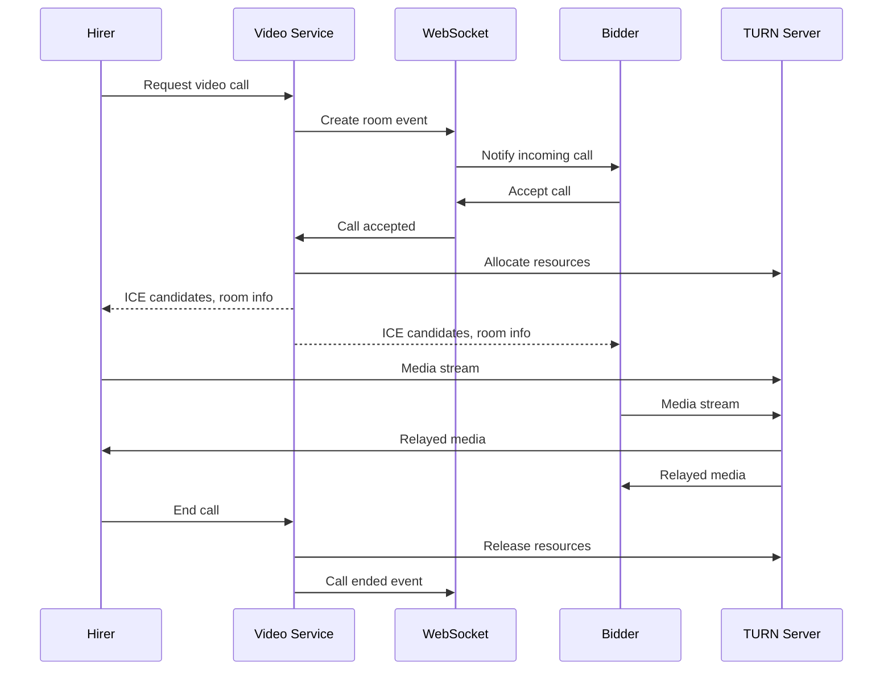

---

## System Architecture Diagram

```mermaid
graph TB
    subgraph "Client Applications"
        Web[React Web App]
        Mobile[React Native App]
    end
    
    subgraph "Cloud Infrastructure - AWS"
        subgraph "VPC"
            subgraph "Load Balancing Layer"
                ALB[Application Load Balancer]
            end
            
            subgraph "API Gateway Layer"
                Kong[Kong API Gateway]
                Auth[JWT Validation]
            end
            
            subgraph "Kubernetes Cluster"
                subgraph "Microservices Namespace"
                    AuthS[Auth Service\nSpring Boot]
                    UserS[User Service\nSpring Boot]
                    GigS[Gig Service\nSpring Boot]
                    BidS[Bid Service\nSpring Boot]
                    ChatS[Chat Service\nSpring Boot]
                    VideoS[Video Service\nSpring Boot]
                    PayS[Payment Service\nSpring Boot]
                    SearchS[Search Service\nSpring Boot]
                end
                
                subgraph "ML Namespace"
                    RecSys[Recommendation\nPython FastAPI]
                end
                
                subgraph "Data Processing"
                    Analytics[Analytics Worker]
                    NotifWorker[Notification Worker]
                end
            end
            
            subgraph "Message Broker"
                Kafka[Apache Kafka\n3 Brokers]
                ZK[ZooKeeper]
            end
            
            subgraph "Data Layer"
                subgraph "SQL Cluster"
                    PG_Auth[(PostgreSQL\nAuth DB)]
                    PG_User[(PostgreSQL\nUser DB)]
                    PG_Bid[(PostgreSQL\nBid DB)]
                    PG_Pay[(PostgreSQL\nPayment DB)]
                end
                
                subgraph "NoSQL Cluster"
                    Mongo_Gig[(MongoDB\nGig DB)]
                    Mongo_Chat[(MongoDB\nChat DB)]
                end
                
                subgraph "Search"
                    ES[Elasticsearch\nCluster]
                end
                
                subgraph "Cache"
                    Redis[(Redis Cluster\nSessions/Cache)]
                end
                
                subgraph "Analytics"
                    CH[ClickHouse]
                end
                
                subgraph "Vector DB"
                    PG_Vector[(pgvector\nEmbeddings)]
                end
            end
        end
    end
    
    subgraph "External Services"
        Stripe[Stripe/Payment Gateway]
        Twilio[Twilio/SMS]
        SendGrid[SendGrid/Email]
        AWS_S3[(S3\nFile Storage)]
        TURN[TURN/STUN\nServers]
    end
    
    Web --> ALB
    Mobile --> ALB
    ALB --> Kong
    Kong --> Auth
    Kong --> AuthS
    Kong --> UserS
    Kong --> GigS
    Kong --> BidS
    Kong --> ChatS
    Kong --> VideoS
    Kong --> PayS
    Kong --> SearchS
    
    AuthS --> PG_Auth
    UserS --> PG_User
    BidS --> PG_Bid
    PayS --> PG_Pay
    
    GigS --> Mongo_Gig
    ChatS --> Mongo_Chat
    GigS --> ES
    SearchS --> ES
    
    GigS --> Kafka
    BidS --> Kafka
    PayS --> Kafka
    ChatS --> Kafka
    
    Kafka --> Analytics
    Kafka --> NotifWorker
    Kafka --> RecSys
    
    RecSys --> PG_Vector
    
    Redis --> AuthS
    Redis --> ChatS
    Redis --> VideoS
    
    Analytics --> CH
    
    PayS --> Stripe
    NotifWorker --> Twilio
    NotifWorker --> SendGrid
    ChatS --> AWS_S3
    VideoS --> TURN
```

---

## Core Workflows

### 1. Gig Posting & Bidding Flow

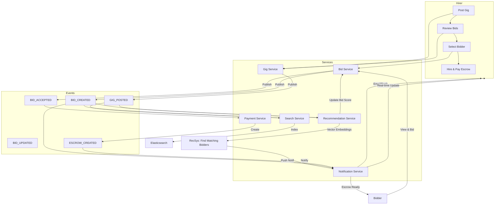

### 2. Payment & Escrow Flow

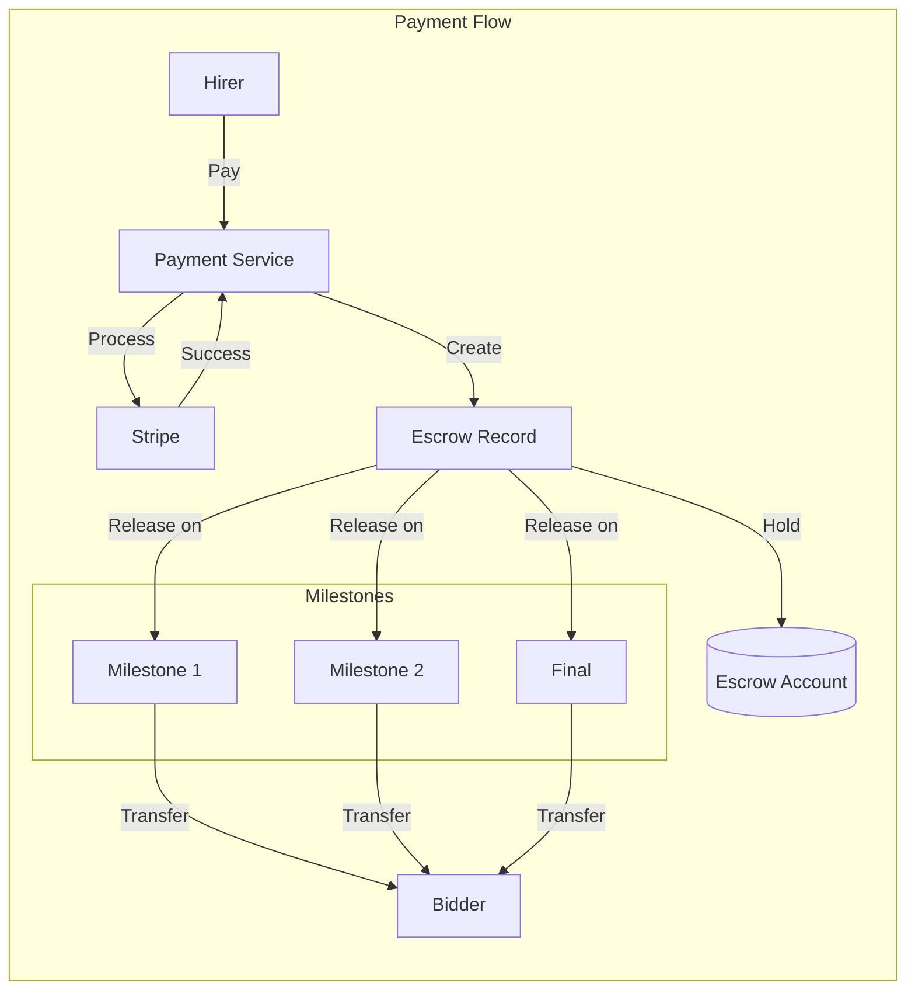

### 3. Recommendation System Flow

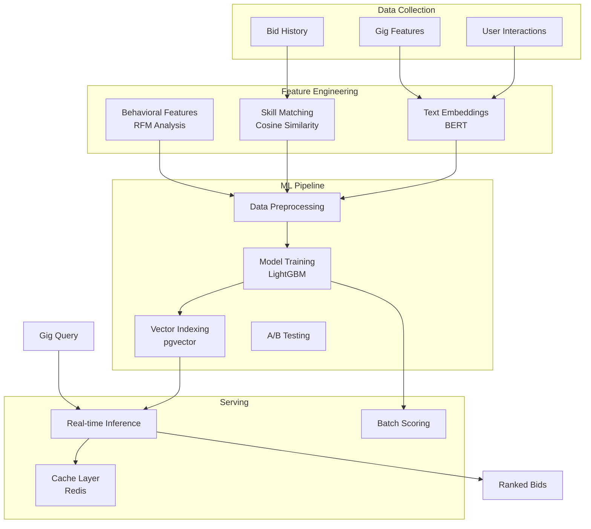

---

## Data Models

### User Model (PostgreSQL)

```sql
CREATE TYPE user_role AS ENUM ('HIRER', 'BIDDER', 'ADMIN');

CREATE TABLE users (
    id UUID PRIMARY KEY DEFAULT gen_random_uuid(),
    email VARCHAR(255) UNIQUE NOT NULL,
    password_hash VARCHAR(255) NOT NULL,
    phone VARCHAR(20),
    role user_role NOT NULL DEFAULT 'BIDDER',
    is_active BOOLEAN DEFAULT true,
    created_at TIMESTAMP WITH TIME ZONE DEFAULT NOW(),
    updated_at TIMESTAMP WITH TIME ZONE DEFAULT NOW()
);

CREATE TABLE hirer_profiles (
    user_id UUID PRIMARY KEY REFERENCES users(id),
    name VARCHAR(255) NOT NULL,
    organisation VARCHAR(255),
    gigs_posted_count INTEGER DEFAULT 0,
    profile_data JSONB DEFAULT '{}'
);

CREATE TABLE bidder_profiles (
    user_id UUID PRIMARY KEY REFERENCES users(id),
    name VARCHAR(255) NOT NULL,
    bank_details JSONB,
    rating DECIMAL(3,2) DEFAULT 0,
    projects_completed INTEGER DEFAULT 0,
    skills TEXT[],
    assigned_gigs UUID[],
    completed_gigs UUID[],
    profile_data JSONB DEFAULT '{}'
);
```

### Gig Model (MongoDB)

```javascript
{
    "_id": ObjectId,
    "gig_id": UUID,
    "hirer_id": UUID,
    "title": String,
    "description": String,
    "skills_required": ["react", "node.js", "typescript"],
    "budget": {
        "min": 500,
        "max": 2000,
        "currency": "USD"
    },
    "start_date": ISODate,
    "deadline": ISODate,
    "posted_at": ISODate,
    "status": "OPEN|HIRED|ONGOING|COMPLETED|MONEY_RELATED",
    "bid_ids": [UUID],
    "metadata": {
        "view_count": 0,
        "applies_count": 0,
        "skill_match_score": 0.95
    }
}
```

### Bid Model (PostgreSQL)

```sql
CREATE TYPE bid_status AS ENUM ('PENDING', 'SHORTLISTED', 'ACCEPTED', 'REJECTED', 'WITHDRAWN');

CREATE TABLE bids (
    id UUID PRIMARY KEY DEFAULT gen_random_uuid(),
    gig_id UUID NOT NULL REFERENCES gigs(gig_id),
    bidder_id UUID NOT NULL REFERENCES users(id),
    proposal TEXT NOT NULL,
    budget DECIMAL(10,2) NOT NULL,
    status bid_status DEFAULT 'PENDING',
    submitted_at TIMESTAMP WITH TIME ZONE DEFAULT NOW(),
    updated_at TIMESTAMP WITH TIME ZONE DEFAULT NOW(),
    UNIQUE(gig_id, bidder_id)
);

CREATE INDEX idx_bids_gig ON bids(gig_id);
CREATE INDEX idx_bids_bidder ON bids(bidder_id);
CREATE INDEX idx_bids_status ON bids(status);
```

### Payment/Escrow Model (PostgreSQL)

```sql
CREATE TYPE payment_status AS ENUM ('PENDING', 'HELD', 'RELEASED', 'REFUNDED', 'DISPUTED');
CREATE TYPE milestone_status AS ENUM ('PENDING', 'IN_PROGRESS', 'COMPLETED', 'APPROVED', 'PAID');

CREATE TABLE escrow_accounts (
    id UUID PRIMARY KEY DEFAULT gen_random_uuid(),
    gig_id UUID NOT NULL,
    hirer_id UUID NOT NULL,
    bidder_id UUID NOT NULL,
    total_amount DECIMAL(12,2) NOT NULL,
    held_amount DECIMAL(12,2) DEFAULT 0,
    status payment_status DEFAULT 'PENDING',
    created_at TIMESTAMP WITH TIME ZONE DEFAULT NOW(),
    updated_at TIMESTAMP WITH TIME ZONE DEFAULT NOW()
);

CREATE TABLE payment_milestones (
    id UUID PRIMARY KEY DEFAULT gen_random_uuid(),
    escrow_id UUID REFERENCES escrow_accounts(id),
    gig_id UUID NOT NULL,
    milestone_number INTEGER NOT NULL,
    description TEXT,
    amount DECIMAL(12,2) NOT NULL,
    status milestone_status DEFAULT 'PENDING',
    due_date TIMESTAMP WITH TIME ZONE,
    completed_at TIMESTAMP WITH TIME ZONE,
    paid_at TIMESTAMP WITH TIME ZONE,
    created_at TIMESTAMP WITH TIME ZONE DEFAULT NOW()
);
```

### Chat Message Model (MongoDB)

```javascript
{
    "_id": ObjectId,
    "message_id": UUID,
    "chat_room_id": UUID,
    "sender_id": UUID,
    "message_type": "TEXT|FILE|IMAGE|SYSTEM",
    "content": {
        "text": "Hello!",
        "file_url": "https://s3...",
        "file_name": "document.pdf",
        "file_size": 1024000
    },
    "metadata": {
        "read_by": [UUID],
        "delivered_to": [UUID],
        "edited": false
    },
    "created_at": ISODate,
    "updated_at": ISODate
}
```

---

## Infrastructure & Deployment

### Kubernetes Architecture

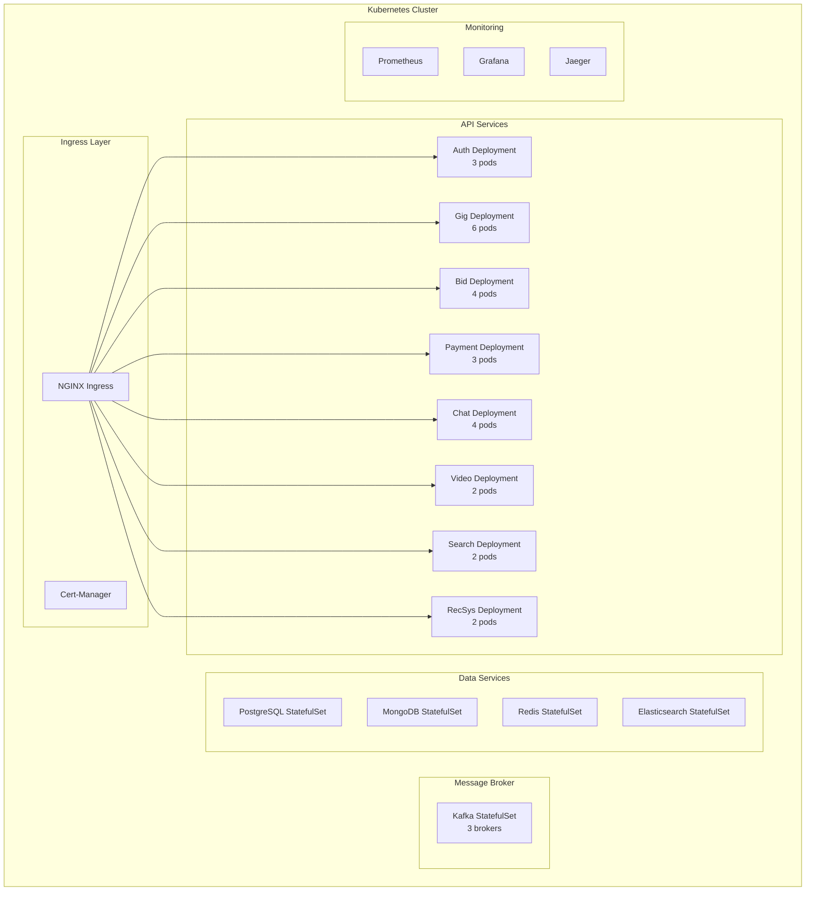

### Infrastructure Components

| Component | Technology | Purpose |
|-----------|------------|---------|
| **Container Orchestration** | Kubernetes (EKS/GKE) | Service deployment, scaling |
| **Ingress Controller** | NGINX Ingress | Load balancing, TLS termination |
| **Service Mesh** | Istio | mTLS, traffic management |
| **Config Management** | Consul/Vault | Secrets, configuration |
| **CI/CD** | GitLab CI/ArgoCD | Automated deployments |
| **Monitoring** | Prometheus + Grafana | Metrics, dashboards |
| **Logging** | ELK Stack (Elasticsearch, Logstash, Kibana) | Centralized logging |
| **Tracing** | Jaeger/Zipkin | Distributed tracing |
| **Backup** | Velero | Disaster recovery |

### Scalability Strategy

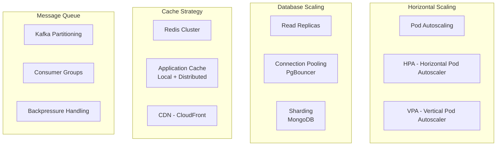

---

## Security Considerations

### Authentication Flow

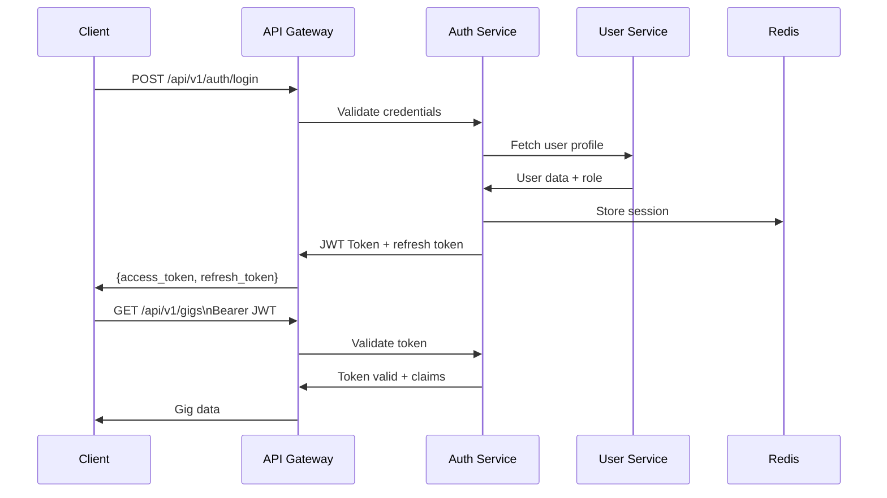

### Security Measures

| Layer | Measure | Implementation |
|-------|---------|----------------|
| **Transport** | TLS 1.3 | All external/internal traffic |
| **API** | Rate Limiting | Token bucket algorithm |
| **API** | Input Validation | Schema validation, sanitization |
| **Auth** | JWT with RS256 | Access + refresh tokens |
| **Auth** | MFA | TOTP for sensitive operations |
| **Data** | Encryption at Rest | AES-256 for databases |
| **Data** | Encryption in Transit | TLS for all connections |
| **Payment** | PCI-DSS Compliance | Stripe integration |
| **Secrets** | Secret Management | HashiCorp Vault |
| **Network** | VPC Isolation | Private subnets, security groups |

---

## API Contracts

### Gig Service API

```yaml
paths:
  /api/v1/gigs:
    get:
      summary: List gigs with filtering
      parameters:
        - name: status
          in: query
          schema:
            type: string
            enum: [OPEN, HIRED, ONGOING, COMPLETED]
        - name: skills
          in: query
          schema:
            type: array
            items:
              type: string
        - name: budget_min
          in: query
          schema:
            type: number
        - name: budget_max
          in: query
          schema:
            type: number
        - name: page
          in: query
          schema:
            type: integer
            default: 1
        - name: size
          in: query
          schema:
            type: integer
            default: 20
      responses:
        200:
          description: Paginated gig list
          content:
            application/json:
              schema:
                $ref: '#/components/schemas/PaginatedGigs'
    
    post:
      summary: Create new gig
      security:
        - BearerAuth: []
      requestBody:
        content:
          application/json:
            schema:
              $ref: '#/components/schemas/CreateGigRequest'
      responses:
        201:
          description: Gig created successfully

  /api/v1/gigs/{gigId}:
    get:
      summary: Get gig details with bids
      responses:
        200:
          description: Gig details
    patch:
      summary: Update gig
      responses:
        200:
          description: Gig updated

components:
  schemas:
    CreateGigRequest:
      type: object
      required:
        - title
        - description
        - skills_required
        - budget
        - deadline
      properties:
        title:
          type: string
          maxLength: 200
        description:
          type: string
          maxLength: 5000
        skills_required:
          type: array
          items:
            type: string
        budget:
          type: object
          properties:
            min:
              type: number
            max:
              type: number
        deadline:
          type: string
          format: date-time

    PaginatedGigs:
      type: object
      properties:
        data:
          type: array
          items:
            $ref: '#/components/schemas/Gig'
        pagination:
          type: object
          properties:
            page:
              type: integer
            size:
              type: integer
            total:
              type: integer
            total_pages:
              type: integer
```

---

## Recommendation System Architecture

### Vector Embedding Pipeline

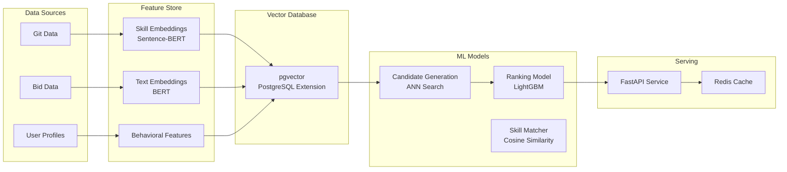

---

## Summary

### Technology Stack Summary

| Layer | Technology |
|-------|------------|
| **Backend (Core)** | Spring Boot 3.x (Java 21) |
| **Backend (ML)** | Python 3.11, FastAPI |
| **API Gateway** | Kong or Spring Cloud Gateway |
| **Message Broker** | Apache Kafka 3.x |
| **SQL Databases** | PostgreSQL 15 + pgvector |
| **NoSQL Databases** | MongoDB 6.x |
| **Search Engine** | Elasticsearch 8.x |
| **Cache** | Redis 7.x Cluster |
| **Analytics** | ClickHouse |
| **Containerization** | Docker, Kubernetes |
| **Real-time** | WebSocket (STOMP), WebRTC |
| **Payment** | Stripe API |
| **Video Calls** | WebRTC with TURN servers |

### Key Design Decisions

1. **Async Communication**: Kafka for all inter-service communication ensures loose coupling and reliability
2. **Polyglot Persistence**: Right database for right use case (PostgreSQL for transactions, MongoDB for documents)
3. **Event Sourcing**: Critical domains (payments) use event sourcing for audit trail
4. **CQRS**: Read-optimized views via Elasticsearch and Redis caching
5. **Real-time First**: WebSocket connections for all interactive features
6. **ML-Enabled**: Dedicated Python service for recommendations with vector embeddings
7. **Cloud-Native**: Kubernetes for orchestration, managed services where appropriate

---

*Architecture Document Version: 1.0*
*Last Updated: 2024-01-31*
